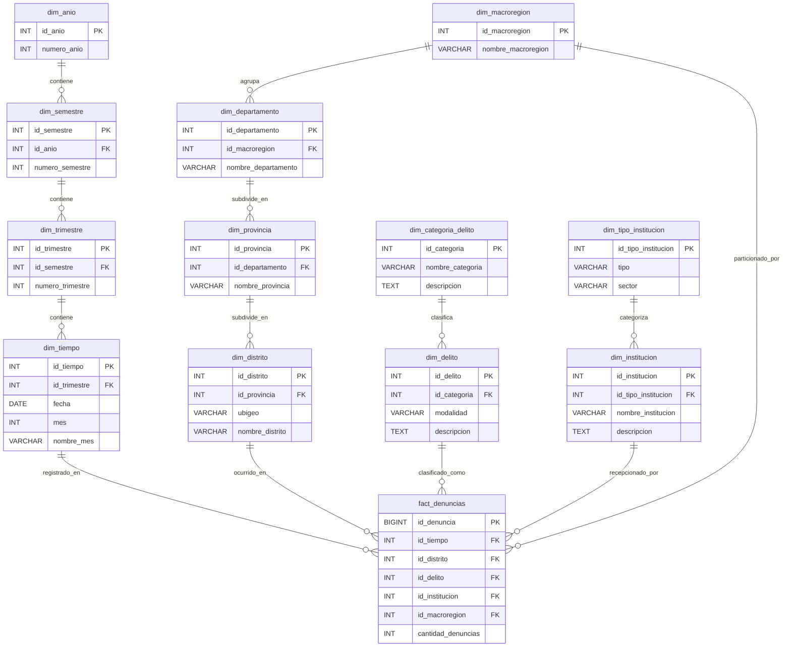

# ARQUITECTURA Y TOPOLOGÍA DE BASE DE DATOS: ESQUEMA COPO DE NIEVE (SNOWFLAKE SCHEMA)

> **Proyecto:** Sistema de Inteligencia y Análisis de Denuncias Policiales — PNP Perú  
> **Área:** Base de Datos Relacional / Data Warehouse (PostgreSQL / Supabase)  
> **Alcance:** Exclusivamente arquitectura de base de datos (Entidades, Relaciones, Normalización, Consultas SQL y Modelado ERD).

---

## 1. DIAGNÓSTICO DEL ESTADO ACTUAL (ESQUEMA ESTRELLA / STAR SCHEMA)

En el diagrama relacional de origen se observa un **Esquema Estrella (Star Schema) con fragmentación horizontal de hechos**:

```text
                           ┌───────────────────────────┐
                           │        dim_tiempo         │
                           └─────────────┬─────────────┘
                                         │
                                         │
┌───────────────────────────┐            │            ┌───────────────────────────┐
│       dim_ubicacion       ├───────┐    │    ┌───────┤        dim_delito         │
└───────────────────────────┘       │    │    │       └───────────────────────────┘
                                    ▼    ▼    ▼
                           ┌───────────────────────────┐
                           │      fact_denuncias       │
                           │  (y fragmentos regionales)│
                           └─────────────▲─────────────┘
                                         │
                                         │
                           ┌─────────────┴─────────────┐
                           │      dim_institucion      │
                           └───────────────────────────┘
```

### Características del modelo actual:
1. **Dimensiones Desnormalizadas (Planadas):**
   - `dim_ubicacion`: Contiene en un solo registro `departamento`, `provincia`, `distrito`, `macroregion` y `ubigeo`.
   - `dim_delito`: Contiene `modalidad` y `categoria` juntas.
   - `dim_tiempo`: Contiene `anio`, `mes`, `nombre_mes`, `trimestre` y `semestre` en la misma tabla.
   - `dim_institucion`: Contiene `nombre_institucion` y `tipo`.
2. **Tabla de Hechos Central (`fact_denuncias`)**:
   - Conecta directamente con las 4 dimensiones a través de claves foráneas (`id_tiempo`, `id_ubicacion`, `id_delito`, `id_institucion`).
   - Posee particiones o fragmentos horizontales por `macroregion` (`fact_denuncias_norte`, `centro`, `sur`, `oriente`).

---

## 2. ¿CÓMO SE TIENE QUE VER LA TOPOLOGÍA DE COPO DE NIEVE (SOLO BASE DE DATOS)?

### Definición Técnica
Un **Esquema Copo de Nieve (Snowflake Schema)** es una estructura de Data Warehouse donde las **tablas de dimensiones se normalizan** (generalmente hasta Tercera Forma Normal - 3FN), descomponiendo las jerarquías de datos en múltiples tablas secundarias interconectadas.

A diferencia del esquema estrella donde las dimensiones son planas y redundantes, en el copo de nieve **las dimensiones se ramifican hacia afuera** desde la tabla de hechos central, asemejándose a los cristales de un copo de nieve.

### Desglose de Jerarquías Normalizadas

```text
                                [ dim_anio ]
                                      ▲
                                      │ (1:N)
                                [ dim_semestre ]
                                      ▲
                                      │ (1:N)
                                [ dim_trimestre ]
                                      ▲
                                      │ (1:N)
                                 [ dim_tiempo ]
                                      ▲
                                      │
[ dim_macroregion ]                   │                   [ dim_categoria_delito ]
       ▲                              │                              ▲
       │ (1:N)                        │                              │ (1:N)
[ dim_departamento ]                  │                        [ dim_delito ]
       ▲                              │                              ▲
       │ (1:N)                        │                              │
 [ dim_provincia ]                    │                              │
       ▲                              │                              │
       │ (1:N)                        │                              │
 [ dim_distrito ] ──────────────► [ FACT_DENUNCIAS ] ◄───────────────┘
                                  (Hechos Centrales)
                                      ▲
                                      │
                                      │
                            [ dim_institucion ]
                                      ▲
                                      │ (1:N)
                          [ dim_tipo_institucion ]
```

### Detalle de Niveles de Ramificación (Topología Física de BD)

#### A. Rama Geográfica (Jerarquía Territorial 1:N)
- **Nivel 3 (Raíz):** `dim_macroregion` (NORTE, CENTRO, SUR, ORIENTE).
- **Nivel 2:** `dim_departamento` (FK hacia `dim_macroregion`).
- **Nivel 1:** `dim_provincia` (FK hacia `dim_departamento`).
- **Nivel 0 (Granularidad Base conectada a Hechos):** `dim_distrito` (FK hacia `dim_provincia`, contiene `ubigeo`).

#### B. Rama Delictiva (Jerarquía Tipológica 1:N)
- **Nivel 1 (Categoría Superior):** `dim_categoria_delito` (Delitos Contra el Patrimonio, Violencia Familiar, etc.).
- **Nivel 0 (Modalidad Conectada a Hechos):** `dim_delito` (FK hacia `dim_categoria_delito`, contiene la modalidad específica: Robo, Hurto, Extorsión, etc.).

#### C. Rama Temporal (Jerarquía Calendario 1:N)
- **Nivel 3 (Anual):** `dim_anio` (2018, 2019, ..., 2026).
- **Nivel 2 (Semestral):** `dim_semestre` (FK hacia `dim_anio`).
- **Nivel 1 (Trimestral):** `dim_trimestre` (FK hacia `dim_semestre`).
- **Nivel 0 (Granularidad Mensual/Fecha conectada a Hechos):** `dim_tiempo` (FK hacia `dim_trimestre`, contiene mes y fecha).

#### D. Rama Institucional (Jerarquía Organizacional 1:N)
- **Nivel 1:** `dim_tipo_institucion` (Policía Nacional, Fiscalía, Juzgado, etc.).
- **Nivel 0:** `dim_institucion` (FK hacia `dim_tipo_institucion`, PNP).

#### E. Núcleo de Hechos (Fact Core)
- **`fact_denuncias`**: Tabla de hechos central que mantiene las FK hacia los nodos de granularidad base (`id_distrito`, `id_delito`, `id_tiempo`, `id_institucion`) y almacena la métrica `cantidad_denuncias`.
- **Fragmentos Horizontales**: `fact_denuncias_norte`, `fact_denuncias_centro`, `fact_denuncias_sur`, `fact_denuncias_oriente`, particionados mediante la restricción `CHECK (id_macroregion = ...)`.

---

## 3. DIAGRAMA ENTIDAD-RELACIÓN (ERD) EN MERMAID



---

## 4. JUSTIFICACIÓN TÉCNICA: ¿POR QUÉ USAR COPO DE NIEVE?

### 1. Eliminación de Redundancia y Anomalías de Modificación (3FN)
- **En Esquema Estrella:** Si se tienen 1,840 distritos y más de 369,100 registros agregados, los nombres textuales de departamentos como `"LIMA METROPOLITANA"` o `"LA LIBERTAD"` se repiten decenas de miles de veces en la tabla dimensional única. Si un departamento cambia de denominación o se corrigen errores ortográficos (como tildes o codificación UTF-8), se deben actualizar miles de filas, arriesgando inconsistencias.
- **En Copo de Nieve:** `"LIMA METROPOLITANA"` se almacena **exactamente una sola vez** en `dim_departamento`. La modificación es instantánea (`UPDATE` en 1 fila) y se propaga automáticamente a todas las consultas analíticas.

### 2. Integridad Referencial Absoluta
- Las llaves foráneas (`FOREIGN KEY`) entre niveles (`distrito -> provincia -> departamento -> macroregion`) garantizan que no puedan existir distritos huérfanos o asociados a departamentos equivocados. La consistencia queda resguardada por el motor de base de datos (PostgreSQL) y no por código de aplicación.

### 3. Reducción de Espacio en Almacenamiento e Índices
- Al reemplazar campos de texto repetitivos (`VARCHAR(100)`) por identificadores enteros (`INT` de 4 bytes), el tamaño físico de las tablas y de los índices B-Tree se reduce notablemente en disco y en la memoria RAM del búfer de la base de datos (`shared_buffers`).

### 4. Soporte Nativo para Jerarquías Analíticas (Drill-Down y Roll-Up)
- En herramientas de Business Intelligence (Power BI, Metabase, Tableau) o consultas OLAP, las jerarquías normalizadas permiten operaciones de:
  - **Roll-Up:** Agrupar desde Distrito hacia Provincia o Departamento sin necesidad de escanear atributos redundantes.
  - **Drill-Down:** Desglosar desde Macroregión hacia el detalle distrital de manera estructurada.

### Cuadro Comparativo: Estrella vs. Copo de Nieve

| Criterio Técnico | Esquema Estrella (Star Schema) | Esquema Copo de Nieve (Snowflake) |
| :--- | :--- | :--- |
| **Grado de Normalización** | Desnormalizado (1FN o 2FN) | Altamente Normalizado (3FN) |
| **Redundancia de Datos** | Alta (cadenas de texto repetidas) | Mínima o Nula |
| **Consistencia e Integridad** | Requiere validación por software | Forzada por el motor vía Foreign Keys |
| **Complejidad de Consultas** | Pocos `JOIN` (consultas planas) | Más `JOIN` (consultas jerárquicas) |
| **Consumo de Almacenamiento** | Mayor tamaño en disco e índices | Menor tamaño físico de almacenamiento |
| **Mantenimiento (DML)** | Costoso y propenso a inconsistencias | Rápido, atómico y limpio |
| **Caso de Uso Ideal** | Datamarts de lectura simple masiva | Data Warehouses maestros y analítica corporativa |

---

## 5. ¿CÓMO SE HICIERON LOS DIAGRAMAS Y QUÉ HERRAMIENTAS SE USARON?

Para modelar y documentar la arquitectura relacional se emplearon estándares reconocidos de la industria:

### 1. Mermaid.js (Diagram as Code)
- **Qué es:** Lenguaje declarativo basado en texto que se compila a diagramas vectoriales SVG.
- **Por qué se usó:** Es soportado de forma nativa por GitHub, GitLab, VS Code y Obsidian. Permite versionar la arquitectura en Git sin depender de imágenes binarias desactualizadas.
- **Sintaxis utilizada:** Bloque `erDiagram` con notación de Crow's Foot (pata de gallo):
  - `||--o{` : Relación uno a muchos (1:N).
  - `PK` : Primary Key.
  - `FK` : Foreign Key.

### 2. DBML (Database Markup Language) para dbdiagram.io
- **Qué es:** Estándar de código abierto diseñado para definir y documentar estructuras de base de datos relacionales de forma legible.
- **Uso:** Puede copiarse directamente en [dbdiagram.io](https://dbdiagram.io) para generar instantáneamente el diagrama interactivo con zoom, exportación a PDF y PNG.

```dbml
// CÓDIGO DBML PARA COPIAR EN DBDATAGRAM.IO

Table dim_macroregion {
  id_macroregion int [pk, increment]
  nombre_macroregion varchar(50) [not null]
}

Table dim_departamento {
  id_departamento int [pk, increment]
  id_macroregion int [not null, ref: > dim_macroregion.id_macroregion]
  nombre_departamento varchar(100) [not null]
}

Table dim_provincia {
  id_provincia int [pk, increment]
  id_departamento int [not null, ref: > dim_departamento.id_departamento]
  nombre_provincia varchar(100) [not null]
}

Table dim_distrito {
  id_distrito int [pk, increment]
  id_provincia int [not null, ref: > dim_provincia.id_provincia]
  ubigeo varchar(6) [not null, unique]
  nombre_distrito varchar(100) [not null]
}

Table dim_categoria_delito {
  id_categoria int [pk, increment]
  nombre_categoria varchar(100) [not null]
  descripcion text
}

Table dim_delito {
  id_delito int [pk, increment]
  id_categoria int [not null, ref: > dim_categoria_delito.id_categoria]
  modalidad varchar(100) [not null]
  descripcion text
}

Table dim_anio {
  id_anio int [pk]
  numero_anio int [not null]
}

Table dim_semestre {
  id_semestre int [pk, increment]
  id_anio int [not null, ref: > dim_anio.id_anio]
  numero_semestre int [not null]
}

Table dim_trimestre {
  id_trimestre int [pk, increment]
  id_semestre int [not null, ref: > dim_semestre.id_semestre]
  numero_trimestre int [not null]
}

Table dim_tiempo {
  id_tiempo int [pk, increment]
  id_trimestre int [not null, ref: > dim_trimestre.id_trimestre]
  fecha date [not null]
  mes int [not null]
  nombre_mes varchar(20) [not null]
}

Table dim_tipo_institucion {
  id_tipo_institucion int [pk, increment]
  tipo varchar(50) [not null]
  sector varchar(100) [not null]
}

Table dim_institucion {
  id_institucion int [pk, increment]
  id_tipo_institucion int [not null, ref: > dim_tipo_institucion.id_tipo_institucion]
  nombre_institucion varchar(150) [not null]
  descripcion text
}

Table fact_denuncias {
  id_denuncia bigint [pk, increment]
  id_tiempo int [not null, ref: > dim_tiempo.id_tiempo]
  id_distrito int [not null, ref: > dim_distrito.id_distrito]
  id_delito int [not null, ref: > dim_delito.id_delito]
  id_institucion int [not null, ref: > dim_institucion.id_institucion]
  id_macroregion int [not null, ref: > dim_macroregion.id_macroregion]
  cantidad_denuncias int [not null, default: 1]
}
```

### 3. Ingeniería Inversa desde PostgreSQL (DBeaver / pgAdmin)
- Si la base de datos ya está creada en PostgreSQL o Supabase, el diagrama se genera de forma automática:
  1. Conectar **DBeaver** a la instancia PostgreSQL mediante credenciales host/puerto/base/usuario.
  2. Hacer clic derecho sobre el esquema `public` -> **"Ver Diagrama"** o `Ctrl + Shift + D`.
  3. DBeaver lee las restricciones `FOREIGN KEY` del catálogo `information_schema.table_constraints` y traza automáticamente la topología visual.

---

## 6. SCRIPT DDL COMPLETO DE CREACIÓN DE BASE DE DATOS (POSTGRESQL / SUPABASE)

```sql
-- ============================================================================
-- ESQUEMA COPO DE NIEVE (SNOWFLAKE SCHEMA) - DENUNCIAS POLICIALES PERÚ
-- MOTOR: PostgreSQL 15+ / Supabase
-- ============================================================================

BEGIN;

-- ----------------------------------------------------------------------------
-- 1. SUBDIMENSIONES DE LA RAMA TEMPORAL
-- ----------------------------------------------------------------------------
CREATE TABLE IF NOT EXISTS dim_anio (
    id_anio INT PRIMARY KEY,
    numero_anio INT NOT NULL UNIQUE
);

CREATE TABLE IF NOT EXISTS dim_semestre (
    id_semestre SERIAL PRIMARY KEY,
    id_anio INT NOT NULL REFERENCES dim_anio(id_anio) ON DELETE RESTRICT,
    numero_semestre INT NOT NULL CHECK (numero_semestre IN (1, 2)),
    CONSTRAINT uq_semestre UNIQUE (id_anio, numero_semestre)
);

CREATE TABLE IF NOT EXISTS dim_trimestre (
    id_trimestre SERIAL PRIMARY KEY,
    id_semestre INT NOT NULL REFERENCES dim_semestre(id_semestre) ON DELETE RESTRICT,
    numero_trimestre INT NOT NULL CHECK (numero_trimestre BETWEEN 1 AND 4),
    CONSTRAINT uq_trimestre UNIQUE (id_semestre, numero_trimestre)
);

CREATE TABLE IF NOT EXISTS dim_tiempo (
    id_tiempo SERIAL PRIMARY KEY,
    id_trimestre INT NOT NULL REFERENCES dim_trimestre(id_trimestre) ON DELETE RESTRICT,
    fecha DATE NOT NULL,
    mes INT NOT NULL CHECK (mes BETWEEN 1 AND 12),
    nombre_mes VARCHAR(20) NOT NULL
);

-- ----------------------------------------------------------------------------
-- 2. SUBDIMENSIONES DE LA RAMA GEOGRÁFICA
-- ----------------------------------------------------------------------------
CREATE TABLE IF NOT EXISTS dim_macroregion (
    id_macroregion SERIAL PRIMARY KEY,
    nombre_macroregion VARCHAR(50) NOT NULL UNIQUE
);

CREATE TABLE IF NOT EXISTS dim_departamento (
    id_departamento SERIAL PRIMARY KEY,
    id_macroregion INT NOT NULL REFERENCES dim_macroregion(id_macroregion) ON DELETE RESTRICT,
    nombre_departamento VARCHAR(100) NOT NULL UNIQUE
);

CREATE TABLE IF NOT EXISTS dim_provincia (
    id_provincia SERIAL PRIMARY KEY,
    id_departamento INT NOT NULL REFERENCES dim_departamento(id_departamento) ON DELETE RESTRICT,
    nombre_provincia VARCHAR(100) NOT NULL,
    CONSTRAINT uq_provincia_dpto UNIQUE (id_departamento, nombre_provincia)
);

CREATE TABLE IF NOT EXISTS dim_distrito (
    id_distrito SERIAL PRIMARY KEY,
    id_provincia INT NOT NULL REFERENCES dim_provincia(id_provincia) ON DELETE RESTRICT,
    ubigeo VARCHAR(6) NOT NULL UNIQUE,
    nombre_distrito VARCHAR(100) NOT NULL
);

-- ----------------------------------------------------------------------------
-- 3. SUBDIMENSIONES DE LA RAMA DELITO
-- ----------------------------------------------------------------------------
CREATE TABLE IF NOT EXISTS dim_categoria_delito (
    id_categoria SERIAL PRIMARY KEY,
    nombre_categoria VARCHAR(100) NOT NULL UNIQUE,
    descripcion TEXT
);

CREATE TABLE IF NOT EXISTS dim_delito (
    id_delito SERIAL PRIMARY KEY,
    id_categoria INT NOT NULL REFERENCES dim_categoria_delito(id_categoria) ON DELETE RESTRICT,
    modalidad VARCHAR(100) NOT NULL UNIQUE,
    descripcion TEXT
);

-- ----------------------------------------------------------------------------
-- 4. SUBDIMENSIONES DE LA RAMA INSTITUCIÓN
-- ----------------------------------------------------------------------------
CREATE TABLE IF NOT EXISTS dim_tipo_institucion (
    id_tipo_institucion SERIAL PRIMARY KEY,
    tipo VARCHAR(50) NOT NULL UNIQUE,
    sector VARCHAR(100) NOT NULL
);

CREATE TABLE IF NOT EXISTS dim_institucion (
    id_institucion SERIAL PRIMARY KEY,
    id_tipo_institucion INT NOT NULL REFERENCES dim_tipo_institucion(id_tipo_institucion) ON DELETE RESTRICT,
    nombre_institucion VARCHAR(150) NOT NULL UNIQUE,
    descripcion TEXT
);

-- ----------------------------------------------------------------------------
-- 5. TABLA DE HECHOS CENTRAL (FACT MASTER)
-- ----------------------------------------------------------------------------
CREATE TABLE IF NOT EXISTS fact_denuncias (
    id_denuncia BIGSERIAL PRIMARY KEY,
    id_tiempo INT NOT NULL REFERENCES dim_tiempo(id_tiempo) ON DELETE RESTRICT,
    id_distrito INT NOT NULL REFERENCES dim_distrito(id_distrito) ON DELETE RESTRICT,
    id_delito INT NOT NULL REFERENCES dim_delito(id_delito) ON DELETE RESTRICT,
    id_institucion INT NOT NULL REFERENCES dim_institucion(id_institucion) ON DELETE RESTRICT,
    id_macroregion INT NOT NULL REFERENCES dim_macroregion(id_macroregion) ON DELETE RESTRICT,
    cantidad_denuncias INT NOT NULL DEFAULT 1 CHECK (cantidad_denuncias >= 0)
);

-- ----------------------------------------------------------------------------
-- 6. FRAGMENTACIÓN HORIZONTAL (PARTICIONES POR MACROREGION)
-- ----------------------------------------------------------------------------
CREATE TABLE IF NOT EXISTS fact_denuncias_norte (
    CHECK (id_macroregion = 1)
) INHERITS (fact_denuncias);

CREATE TABLE IF NOT EXISTS fact_denuncias_centro (
    CHECK (id_macroregion = 2)
) INHERITS (fact_denuncias);

CREATE TABLE IF NOT EXISTS fact_denuncias_sur (
    CHECK (id_macroregion = 3)
) INHERITS (fact_denuncias);

CREATE TABLE IF NOT EXISTS fact_denuncias_oriente (
    CHECK (id_macroregion = 4)
) INHERITS (fact_denuncias);

-- ----------------------------------------------------------------------------
-- 7. ÍNDICES B-TREE PARA OPTIMIZACIÓN DE RECORRIDO EN EL COPO DE NIEVE
-- ----------------------------------------------------------------------------
CREATE INDEX IF NOT EXISTS idx_fk_distrito_provincia ON dim_distrito(id_provincia);
CREATE INDEX IF NOT EXISTS idx_fk_provincia_dpto ON dim_provincia(id_departamento);
CREATE INDEX IF NOT EXISTS idx_fk_dpto_macroregion ON dim_departamento(id_macroregion);
CREATE INDEX IF NOT EXISTS idx_fk_delito_categoria ON dim_delito(id_categoria);
CREATE INDEX IF NOT EXISTS idx_fk_tiempo_trimestre ON dim_tiempo(id_trimestre);
CREATE INDEX IF NOT EXISTS idx_fk_trimestre_semestre ON dim_trimestre(id_semestre);
CREATE INDEX IF NOT EXISTS idx_fk_semestre_anio ON dim_semestre(id_anio);

CREATE INDEX IF NOT EXISTS idx_fact_tiempo ON fact_denuncias(id_tiempo);
CREATE INDEX IF NOT EXISTS idx_fact_distrito ON fact_denuncias(id_distrito);
CREATE INDEX IF NOT EXISTS idx_fact_delito ON fact_denuncias(id_delito);
CREATE INDEX IF NOT EXISTS idx_fact_macro ON fact_denuncias(id_macroregion);

COMMIT;
```

---

## 7. CONSULTAS SQL ADAPTADAS A LA TOPOLOGÍA DE COPO DE NIEVE

Al estar normalizado el esquema, las consultas de negocio navegan a través de las ramas del copo mediante cláusulas `JOIN`:

### Consulta 1: Total de Denuncias por Departamento (Navegación en Rama Geográfica)
```sql
SELECT 
    dpto.nombre_departamento,
    SUM(f.cantidad_denuncias) AS total_denuncias
FROM fact_denuncias f
JOIN dim_distrito dist ON f.id_distrito = dist.id_distrito
JOIN dim_provincia prov ON dist.id_provincia = prov.id_provincia
JOIN dim_departamento dpto ON prov.id_departamento = dpto.id_departamento
GROUP BY dpto.nombre_departamento
ORDER BY total_denuncias DESC;
```

### Consulta 2: Top 10 Departamentos más Afectados con su Macroregión
```sql
SELECT 
    dpto.nombre_departamento,
    macro.nombre_macroregion,
    SUM(f.cantidad_denuncias) AS total_denuncias
FROM fact_denuncias f
JOIN dim_distrito dist ON f.id_distrito = dist.id_distrito
JOIN dim_provincia prov ON dist.id_provincia = prov.id_provincia
JOIN dim_departamento dpto ON prov.id_departamento = dpto.id_departamento
JOIN dim_macroregion macro ON dpto.id_macroregion = macro.id_macroregion
GROUP BY dpto.nombre_departamento, macro.nombre_macroregion
ORDER BY total_denuncias DESC
LIMIT 10;
```

### Consulta 3: Top 10 Distritos con Mayor Incidencia Delictiva a Nivel Nacional
```sql
SELECT 
    dist.ubigeo,
    dist.nombre_distrito,
    prov.nombre_provincia,
    dpto.nombre_departamento,
    SUM(f.cantidad_denuncias) AS total_denuncias
FROM fact_denuncias f
JOIN dim_distrito dist ON f.id_distrito = dist.id_distrito
JOIN dim_provincia prov ON dist.id_provincia = prov.id_provincia
JOIN dim_departamento dpto ON prov.id_departamento = dpto.id_departamento
GROUP BY dist.ubigeo, dist.nombre_distrito, prov.nombre_provincia, dpto.nombre_departamento
ORDER BY total_denuncias DESC
LIMIT 10;
```

### Consulta 4: Denuncias por Categoría y Modalidad Delictiva (Rama Delitos)
```sql
SELECT 
    cat.nombre_categoria,
    d.modalidad,
    SUM(f.cantidad_denuncias) AS total_denuncias
FROM fact_denuncias f
JOIN dim_delito d ON f.id_delito = d.id_delito
JOIN dim_categoria_delito cat ON d.id_categoria = cat.id_categoria
GROUP BY cat.nombre_categoria, d.modalidad
ORDER BY total_denuncias DESC;
```

### Consulta 5: Evolución Histórica Anual (Drill-Up Temporal Completo)
```sql
SELECT 
    a.numero_anio,
    SUM(f.cantidad_denuncias) AS total_denuncias
FROM fact_denuncias f
JOIN dim_tiempo t ON f.id_tiempo = t.id_tiempo
JOIN dim_trimestre tri ON t.id_trimestre = tri.id_trimestre
JOIN dim_semestre sem ON tri.id_semestre = sem.id_semestre
JOIN dim_anio a ON sem.id_anio = a.id_anio
GROUP BY a.numero_anio
ORDER BY a.numero_anio ASC;
```

### Consulta 6: Evolución Mensual Detallada
```sql
SELECT 
    a.numero_anio,
    t.mes,
    t.nombre_mes,
    SUM(f.cantidad_denuncias) AS total_denuncias
FROM fact_denuncias f
JOIN dim_tiempo t ON f.id_tiempo = t.id_tiempo
JOIN dim_trimestre tri ON t.id_trimestre = tri.id_trimestre
JOIN dim_semestre sem ON tri.id_semestre = sem.id_semestre
JOIN dim_anio a ON sem.id_anio = a.id_anio
GROUP BY a.numero_anio, t.mes, t.nombre_mes
ORDER BY a.numero_anio ASC, t.mes ASC;
```

### Consulta 7: Comparativa de Regiones Estratégicas (Lima vs Arequipa vs La Libertad)
```sql
SELECT 
    dpto.nombre_departamento,
    cat.nombre_categoria,
    SUM(f.cantidad_denuncias) AS total_denuncias
FROM fact_denuncias f
JOIN dim_distrito dist ON f.id_distrito = dist.id_distrito
JOIN dim_provincia prov ON dist.id_provincia = prov.id_provincia
JOIN dim_departamento dpto ON prov.id_departamento = dpto.id_departamento
JOIN dim_delito d ON f.id_delito = d.id_delito
JOIN dim_categoria_delito cat ON d.id_categoria = cat.id_categoria
WHERE dpto.nombre_departamento IN ('LIMA METROPOLITANA', 'AREQUIPA', 'LA LIBERTAD')
GROUP BY dpto.nombre_departamento, cat.nombre_categoria
ORDER BY dpto.nombre_departamento, total_denuncias DESC;
```

### Consulta 8: Filtro Multidimensional por Rango Temporal y Categoría Delictiva
```sql
SELECT 
    a.numero_anio,
    sem.numero_semestre,
    cat.nombre_categoria,
    SUM(f.cantidad_denuncias) AS total_denuncias
FROM fact_denuncias f
JOIN dim_tiempo t ON f.id_tiempo = t.id_tiempo
JOIN dim_trimestre tri ON t.id_trimestre = tri.id_trimestre
JOIN dim_semestre sem ON tri.id_semestre = sem.id_semestre
JOIN dim_anio a ON sem.id_anio = a.id_anio
JOIN dim_delito d ON f.id_delito = d.id_delito
JOIN dim_categoria_delito cat ON d.id_categoria = cat.id_categoria
WHERE a.numero_anio BETWEEN 2023 AND 2025
GROUP BY a.numero_anio, sem.numero_semestre, cat.nombre_categoria
ORDER BY a.numero_anio ASC, sem.numero_semestre ASC, total_denuncias DESC;
```

### Consulta 9: Análisis Detallado del Distrito con Mayor Densidad (San Juan de Lurigancho)
```sql
SELECT 
    dist.nombre_distrito,
    cat.nombre_categoria,
    d.modalidad,
    SUM(f.cantidad_denuncias) AS total_denuncias
FROM fact_denuncias f
JOIN dim_distrito dist ON f.id_distrito = dist.id_distrito
JOIN dim_delito d ON f.id_delito = d.id_delito
JOIN dim_categoria_delito cat ON d.id_categoria = cat.id_categoria
WHERE dist.nombre_distrito = 'SAN JUAN DE LURIGANCHO'
GROUP BY dist.nombre_distrito, cat.nombre_categoria, d.modalidad
ORDER BY total_denuncias DESC;
```

### Consulta 10: Consulta Directa sobre Fragmento Particionado (Partition Pruning: NORTE)
```sql
SELECT 
    dpto.nombre_departamento,
    prov.nombre_provincia,
    dist.nombre_distrito,
    d.modalidad,
    SUM(fn.cantidad_denuncias) AS total_denuncias
FROM fact_denuncias_norte fn
JOIN dim_distrito dist ON fn.id_distrito = dist.id_distrito
JOIN dim_provincia prov ON dist.id_provincia = prov.id_provincia
JOIN dim_departamento dpto ON prov.id_departamento = dpto.id_departamento
JOIN dim_delito d ON fn.id_delito = d.id_delito
GROUP BY dpto.nombre_departamento, prov.nombre_provincia, dist.nombre_distrito, d.modalidad
ORDER BY total_denuncias DESC
LIMIT 50;
```

---

## 8. SCRIPT DE POBLACIÓN / MIGRACIÓN AL ESQUEMA COPO DE NIEVE

Si se desea poblar automáticamente las subdimensiones normalizadas a partir de la tabla plana previa `dim_ubicacion`, `dim_delito` y `dim_tiempo`, se ejecutan las siguientes instrucciones DML:

```sql
BEGIN;

-- 1. Poblar dim_macroregion
INSERT INTO dim_macroregion (id_macroregion, nombre_macroregion) VALUES
(1, 'NORTE'),
(2, 'CENTRO'),
(3, 'SUR'),
(4, 'ORIENTE')
ON CONFLICT (id_macroregion) DO NOTHING;

-- 2. Poblar dim_departamento vinculándolo a macroregión
INSERT INTO dim_departamento (nombre_departamento, id_macroregion)
SELECT DISTINCT departamento, 
       CASE 
         WHEN macroregion = 'NORTE' THEN 1
         WHEN macroregion = 'CENTRO' THEN 2
         WHEN macroregion = 'SUR' THEN 3
         WHEN macroregion = 'ORIENTE' THEN 4
         ELSE 2
       END
FROM dim_ubicacion
ON CONFLICT (nombre_departamento) DO NOTHING;

-- 3. Poblar dim_provincia vinculándola a departamento
INSERT INTO dim_provincia (nombre_provincia, id_departamento)
SELECT DISTINCT u.provincia, d.id_departamento
FROM dim_ubicacion u
JOIN dim_departamento d ON u.departamento = d.nombre_departamento
ON CONFLICT (id_departamento, nombre_provincia) DO NOTHING;

-- 4. Poblar dim_distrito vinculándolo a provincia
INSERT INTO dim_distrito (ubigeo, nombre_distrito, id_provincia)
SELECT DISTINCT u.ubigeo, u.distrito, p.id_provincia
FROM dim_ubicacion u
JOIN dim_departamento d ON u.departamento = d.nombre_departamento
JOIN dim_provincia p ON u.provincia = p.nombre_provincia AND p.id_departamento = d.id_departamento
ON CONFLICT (ubigeo) DO NOTHING;

-- 5. Poblar dim_categoria_delito
INSERT INTO dim_categoria_delito (nombre_categoria, descripcion) VALUES
('Delitos Contra la Mujer y Grupo Familiar', 'Infracciones a la ley 30364 y agresiones familiares'),
('Delitos Contra el Patrimonio y Seguridad', 'Hurtos, robos, estafas, extorsión y afines')
ON CONFLICT (nombre_categoria) DO NOTHING;

-- 6. Poblar dim_delito normalizado
INSERT INTO dim_delito (modalidad, id_categoria, descripcion)
SELECT DISTINCT 
    d.modalidad,
    c.id_categoria,
    d.descripcion
FROM dim_delito d
JOIN dim_categoria_delito c ON d.categoria = c.nombre_categoria
ON CONFLICT (modalidad) DO NOTHING;

-- 7. Poblar jerarquía temporal
INSERT INTO dim_anio (id_anio, numero_anio)
SELECT DISTINCT anio, anio FROM dim_tiempo
ON CONFLICT (id_anio) DO NOTHING;

INSERT INTO dim_semestre (id_anio, numero_semestre)
SELECT DISTINCT anio, semestre FROM dim_tiempo
ON CONFLICT (id_anio, numero_semestre) DO NOTHING;

INSERT INTO dim_trimestre (id_semestre, numero_trimestre)
SELECT DISTINCT s.id_semestre, t.trimestre
FROM dim_tiempo t
JOIN dim_semestre s ON t.anio = s.id_anio AND t.semestre = s.numero_semestre
ON CONFLICT (id_semestre, numero_trimestre) DO NOTHING;

COMMIT;
```

---

## 10. CARDINALIDAD VS. MÉTRICA: ¿POR QUÉ 369,100 FILAS Y ~7.3 MILLONES DE DENUNCIAS?

Una duda recurrente en auditorías de Data Warehouse es la relación entre el número de filas del CSV y los millones de denuncias reflejados en las consultas:

```text
  CSV DE ENTRADA / TABLA FACT_DENUNCIAS
  ┌─────────────────────────────────────────────────────────────┐
  │ 369,100 Filas Físicas (Tuplas Únicas en Disco)             │
  │ SELECT COUNT(*) FROM fact_denuncias;  -->  369,100          │
  └──────────────────────────────┬──────────────────────────────┘
                                 │ Sumatoria de Métrica
                                 ▼
  ┌─────────────────────────────────────────────────────────────┐
  │ 7,359,931 Denuncias Reales Acumuladas                       │
  │ SELECT SUM(cantidad_denuncias) FROM fact_denuncias;         │
  └─────────────────────────────────────────────────────────────┘
```

### Explicación de Arquitectura de Datos:
1. **Granularidad Agrupada (Micro-Lote Espaciotemporal):**  
   La Policía Nacional del Perú (PNP) y el MININTER no publican una fila por cada persona denunciante por **estricta privacidad (Ley de Protección de Datos Personales N° 29733)** y para evitar generar archivos inmanejables de varios gigabytes.
2. **Estructura de la Tupla:**  
   Cada fila del dataset representa una combinación única de dimensiones:  
   `[Año, Mes, Departamento, Provincia, Distrito, Modalidad Delictiva]`.
3. **Métrica Acumulativa (`cantidad`):**  
   Al final de cada fila existe el campo numérico `cantidad`. Por ejemplo:
   - Fila #4: `2018 | Enero | AMAZONAS | BAGUA | Hurto | cantidad: 25`  
     *(1 sola fila física en la base de datos representa 25 denuncias policiales reales consumadas).*
   - Fila #5: `2018 | Enero | LIMA | SAN JUAN DE LURIGANCHO | Robo | cantidad: 52`  
     *(1 sola fila física representa 52 robos investigados).*

---

## 11. TRATAMIENTO Y TRANSFORMACIÓN DE CARACTERES ESPECIALES (TILDES Y LETRA "Ñ") EN EL ETL

El idioma español presenta caracteres críticos como vocales acentuadas (`á`, `é`, `í`, `ó`, `ú`) y la letra `ñ` (`Ñ`), comunes en la toponimia peruana (ej. *Cañete*, *Ferreñafe*, *Huánuco*, *San Martín*) y en tipos de delito (*Extorsión*).

### 1. El Problema de Origen (Encoding Mismatch y Mojibake)
- Los archivos exportados desde sistemas legacy estatales peruanos suelen estar codificados en **`latin1` (ISO-8859-1)** o **Windows-1252**.
- Si un motor intenta leer el archivo asumiendo **`UTF-8`** de forma predeterminada, los bytes extendidos (como `0xF3` para `ó` o `0xF1` para `ñ`) se interpretan erróneamente como caracteres corruptos (**mojibake**):  
  `"Extorsión"`, `"Cañete"`, `"Extorsin"`.

### 2. Pipeline de Transformación Aplicado en `etl/etl_snowflake.py`:
1. **Lectura con Encoding Explícito:**  
   ```python
   df = pd.read_csv('DATASET_Denuncias_Policiales_Ene 2018 a Julio 2026.csv', encoding='latin1')
   ```
   Garantiza que cada byte del alfabeto latino extendido sea interpretado sin pérdida de información.
2. **Normalización y Sanitización de Cadenas:**  
   ```python
   # Diccionario de limpieza y saneamiento de variantes corruptas
   MODALIDAD_CLEAN_MAP = {
       'Extorsión': 'Extorsión',
       'Extorsin': 'Extorsión',
       'Extorsión': 'Extorsión'
   }
   df['P_MODALIDADES'] = df['P_MODALIDADES'].replace(MODALIDAD_CLEAN_MAP)
   df.loc[df['P_MODALIDADES'].str.startswith('Extorsi'), 'P_MODALIDADES'] = 'Extorsión'
   ```
3. **Conversión a Mayúsculas Canónicas (Case-Insensitive Standardization):**  
   ```python
   df['DPTO_HECHO_NEW'] = df['DPTO_HECHO_NEW'].str.strip().str.upper()
   df['PROV_HECHO'] = df['PROV_HECHO'].str.strip().str.upper()
   df['DIST_HECHO'] = df['DIST_HECHO'].str.strip().str.upper()
   ```
4. **Almacenamiento en PostgreSQL / Supabase:**  
   PostgreSQL opera de forma nativa con `SERVER_ENCODING = 'UTF8'` y `CLIENT_ENCODING = 'UTF8'`. La ingesta en base de datos preserva los nombres oficiales legítimos (*FERREÑAFE*, *CAÑETE*, *BREÑA*, *SAN MARTÍN*) y almacena las modalidades limpias.

---

## 12. RESUMEN: CÓMO RECONOCER VISUALMENTE EL COPO DE NIEVE

| Elemento Visual | En Esquema Estrella | En Esquema Copo de Nieve (BD) |
| :--- | :--- | :--- |
| **Punto Central** | Tabla de hechos `fact_denuncias` | Tabla de hechos `fact_denuncias` |
| **Primer Anillo** | Todas las dimensiones (`dim_tiempo`, `dim_ubicacion`, etc.) | Solo las dimensiones de granularidad base (`distrito`, `delito`, `tiempo`, `institucion`) |
| **Anillos Exteriores** | Ninguno (no hay más tablas) | **Subdimensiones jerárquicas** (`provincia` -> `departamento` -> `macroregion`; `trimestre` -> `semestre` -> `anio`; `categoria_delito`) |
| **Forma Geométrica** | Una estrella simple (1 centro, N satélites aislados) | **Un copo fractal** (el centro se ramifica en cadenas de dependencias jerárquicas) |

---
*Documento técnico de arquitectura de bases de datos generado para el proyecto de Análisis de Denuncias Policiales PNP Perú.*
